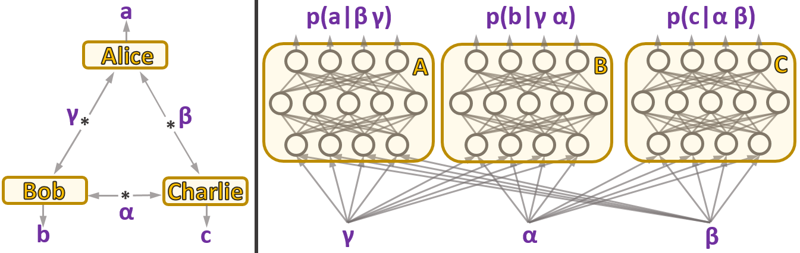

# Neural Network for Nonlocality in Networks
Code for the work in: https://arxiv.org/abs/1907.10552

If you use this code please cite
T. Kriváchy, Y. Cai, D. Cavalcanti, A. Tavakoli, N. Gisin, N. Brunner, A neural network oracle for quantum nonlocality problems in networks, arXiv:1907.10552

## Intro
In the paper above, we describe a generative neural network to tackle the classical causal inference problem encountered in quantum network nonlocality. The neural network basically tries to learn classical/local models for a given distribution and causal structure.

## Usage
In sample_code, set your parameters in config.py. Then run train.py. For a first test, **just run train.py** to see training for the Fritz distribution and its noisy versions (visibility added to the singlet). You should get something like this in the figs_training_sweep directory: (should take about 15 minutes using an average CPU)

 vs visibility.")

Notice that the transition is around 1/sqrt(2), as expected.

In case you'd like to modify the sample target distribution, you can choose between the elegant distribution, Fritz distribution, and Renou et al. distribution, or implement your own! See detailed namings in `targets.py` and update target distribution in `config.py`. You can update most other hyperparameters also in `config.py`.

In case you'd like to modify the causal structure, check out `utils.py`. It is currently set to be the triangle structure.

Some distributions are more difficult to learn than others. In case you need more power to tackle the target distributions, it is recommended to use something like `train_multiple_sweeps.py`, which runs over all target distributions multiple times (multiple sweeps). This way you can monitor your training progress by checking the plots which are constantly being generated. This script also allows for learning from neighboring models and changing optimizer parameters in different training sweeps to have more refined training towards the end (e.g. smaller learning rates, or larger batch size). Note that for learning from neighbors there is a `broadness_right` and `broadness_left` parameter. In the sample code both of these are set to either 0 (just start from previous best model for this distribution) or the full length of distributions (check all other models and choose best one to continue from - though typically neighboring ones will be the best). However, you can set it to be e.g. `broadness_left = -1`, `broadness_right = 1`, which will force each model to load in the previous best model of its right neighbor. This is practical in many cases since the machine seems to have an easier time learning more noisy distributions. Hence starting from a cleaner one and learning to make it a bit noisy can be useful sometime. Alternatively you might have a good model for a single distribution and want to check the noise tolerance. Then just run the code with such broadness settings and the machine will have a good starting point to learn from.

In the `sample_multiple_sweeps` directory you can find code that tries to learn the elegant distribution. With current parameters, running on a mediocre PC it should finish the whole loop in just over a day. However, you can stop anytime and pick up from where you left off just by just running `train_multiple_sweeps.py` again (it always saves the most recent config file and continues from the start of the most recent sweep). Obviously, using a GPU gives a much appreciated speedup at this level.

## Code structure
In sample_code you will find sample code for running the algorithm (including adding noise), for several possible distributions.

* `config.py`: Contains the Config class. A joint, global config object (named pnn, for Parameter of Neural Network) is used among all files. This contains (almost) all meta-data related to the neural network, target distribution, and training. Note that the causal structure is not in the config, but is instead defined in utils.py.
* `utils.py`: Contains utilities. Most notably the build_model() function is located here, which defines the causal structure.
* `targets.py`: Auxiliary file used by me to generate target distributions. If you want your own target distributions either add them to the list in this file, or just load them directly into Config class and disregard the targets.py file.
* `train.py`: Run this python script to train the network for a set of target distributions. Target distributions and neural network parameters should be defined in config.py.

In sample_code_multiple_sweeps you will additionally find
* `train_multiple_sweeps.py`: Does the same as train.py, except after doing a sweep over all target distributions, it continues to do more sweeps, potentially with different optimization parameters. Useful if you want to run code for a long time and continue from previous ones if you had to cut the computations short. Also useful for refining optimization parameters for the next sweeps, allowing to reduce learning rate in SGD or similar things. Also implements learning from neighboring distributions.

## Output
In the sample code we look at the Fritz distribution for 10 different singlet visibility levels between 0.5 and 1. 
* `figs_training_sweeps`: Contains the distances as a function of visibility.
* `figs_distributions`: Contains the target distributions (red dots) and the learned distributions (green squares), for each of the 10 target distributions.
* `saved_models`: Contains final models for each of the 10 target distribution examined.
* `saved_results`: Contains final distances for each of the 10 target distributions.

## Future updates
The core functionality of the algorithm can be found in the current sample codes. However, planned updates are:
* Adding a function to plot the learned strategies. (flags)
* Adding a script to fit curves to the distance data, in order to be able to extract v* and &theta * easily.
